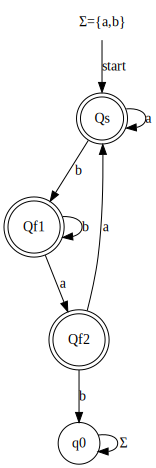
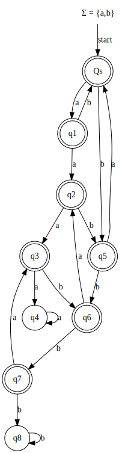
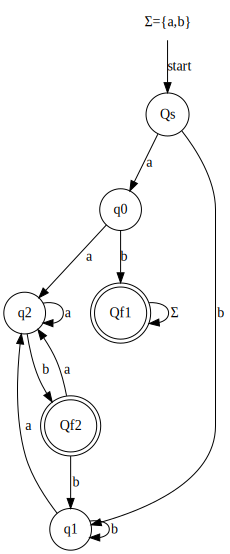
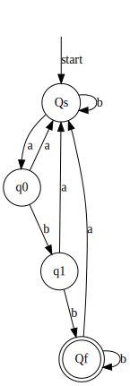
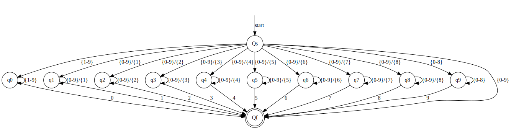
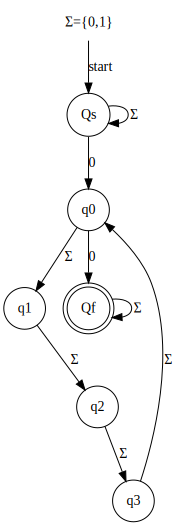
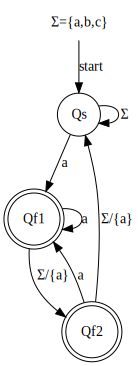
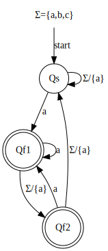
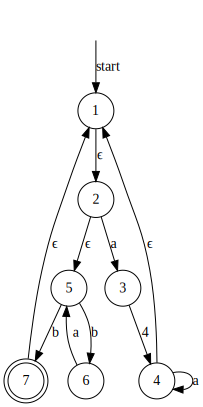
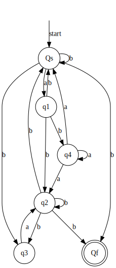

<h3>
COMP 335  
Philip Dumaresq - 40082638 
Assignment 01 
Gosta Grahne
</h3>

---

### Question 1
Let $Σ = \{a,b\}$. For each of the languages below, give an example of a string in the language, and a string not in the language.
1. $\{w∈Σ^∗∶~w=uu^Ru, \text{ for some }u∈Σ^2\}$
   - Valid: $ab~ba~ab$
   - Invalid: $ab~ab~ab$
2. $\{w∈Σ^∗∶~ww=www\}$
   - Valid: $\epsilon$
   - Invalid: $aaa$
3. $\{w∈Σ^∗∶~uvw=wvu, \text{ for some } \{u,v\}⊂Σ^∗\}$
   - Valid: $ab~aa~ab$
   - Invalid: $bb~ab~~aa$
4. $\{w∈Σ^∗∶~www=uu, \text{ for some } u∈Σ^∗\}$
   - Valid: $w=aa, \text{ if } u=aaa \therefore www=uu=aaaaaa$
   - Invalid: $ab~ab~ab~ab~ab$

---

### Question 2
**Double points.** Let $Σ$ be a finite alphabet. If $x,y∈Σ^⋆$ then it is possible that $xy=yx$, for instance when $y=ϵ$. What if we also require that neither $x$ nor $y$ is equal to $ϵ$. Either prove that this cannot happen, or describe precisely the conditions under which it always happens.

For $xy=yx$ with neither $x\neq\epsilon$ and $y\neq\epsilon$, then $x=y$.

---

<!--           -->
### Question 3
Let $L=\{0x1∶~x∈\{0,1\}^∗\}$. Prove by induction that any string in $L$ contains the substring $01$.

**Base case:**
$|x| = 0, x =\epsilon$
$w = 01$, which contains $01$, so we know it's true for the base case.

**Inductive hypothesis:**
For this to hold, it must work on any string of length $s$ and $s+1$.
$|w| = s$

Case 1: $x$ contains only $0$s.
$x = 00...00$
$w = 0x1 = 000...001$
Contains $01$ as last two characters.

Case 2: $x$ contains only $1$s.
$x = 11...11$
$w = 0x1 = 011...111$
Contains $01$ as the first two characters

Case 3: $x$ contains both $0$s and $1$s.
$x = 0101...0101$
$w = 0x1 = 00101...01011$
Contains $01$ wherever the first 1 appears in the substring.

---

<!--                    -->
### Question 4
Construct DFA’s $A_1,A_2,A_3,A_4$, such that $L(A_i)=L_i, \text{ for } i∈\{1,2,3,4\}$, where  the $L_i$’s are as below. Specify each DFA formally, as $A_i=(Q_i,Σ_i,δ_i,s_i,F_i)$ and define all the components $Q_i,Σ_i,...$ formally, using the notation in the textbook.

1. $L_1=Σ* \backslash \{xbaby∶x,y∈Σ^∗\}$, where $Σ=\{a,b\}$.
    

    

     

    $A =\{Q, \Sigma, \delta, s, F\}$
    $Q=\{Qs,Qf1,Qf2,q0\}$
    $\Sigma=\{a,b\}$
    $s = Qs$
    $F=\{Qs,Qf_1,Qf_2\}$
    $\delta=$
    | $\delta$ | a      | b      |
    | -------: | :----- | :----- |
    | $\to Qs$ | $Qs$   | $Qf_1$ |
    |   $Qf_1$ | $Qf_2$ | $Qf_1$ |
    |   $Qf_2$ | $Qs$   | $q0$   |
    |     $q0$ | $q0$   | $q0$   |
    

    

    
    

    

2. $L_2=\{w∈\{a,b\}∶|n_a(w)−n_b(w)|≤3\}$
    

    

     

    $A = \{Q,\Sigma,\delta, s, F\}$
    $Q=\{Qs,q_1,q_2,q_3,q_4,q_5,q_6,q_7,q_8\}$
    $\Sigma=\{a,b\}$
    $s = Qs$
    $F=\{Qs,q_0,q_1,q_2,q_3,q_5,q_6,q_7\}$
    $\delta=$
    |           |   $a$ |   $b$ |
    | --------: | ----: | ----: |
    | $\to *Qs$ | $q_1$ | $q_5$ |
    |    $*q_1$ | $q_2$ | $q_0$ |
    |    $*q_2$ | $q_1$ | $q_3$ |
    |    $*q_3$ | $q_2$ | $q_4$ |
    |     $q_4$ | $q_4$ | $q_4$ |
    |    $*q_5$ |  $Qs$ | $q_6$ |
    |    $*q_6$ | $q_5$ | $q_7$ |
    |    $*q_7$ | $q_6$ | $q_8$ |
    |     $q_8$ | $q_8$ | $q_8$ |

    

    

    
    

    

3. $L_4$ is the set of strings over $\{a,b\}^∗$ that either begin or end (or both) with $ab$.
    

    

     

    $A = \{Q,\Sigma,\delta, s, F\}$
    $Q=\{Qs,q_0,Qf_1,q_1,q_2,Qf_2\}$
    $\Sigma=\{a,b\}$
    $s = Qs$
    $F=\{Qf_1,Qf_2\}$
    $\delta=$
    | $\delta$ | $a$    | $b$    |
    | -------: | :----- | :----- |
    | $\to Qs$ | $q_0$  | $q_1$  |
    |    $q_0$ | $q_2$  | $Qf_1$ |
    |    $q_1$ | $q_2$  | $q_1$  |
    |    $q_2$ | $q_2$  | $Qf_2$ |
    |  $*Qf_1$ | $Qf_1$ | $Qf_1$ |
    |  $*Qf_2$ | $q_2$  | $q_1$  |

    

    

    
    

    

4. $L_5$ is the set of strings over $\{a,b\}^∗$ that contain an odd number of $a$’s and end in at least two $b$’s.
    

    

     

    $A = \{Q,\Sigma,\delta, s, F\}$
    $Q=\{Qs,q_0,q_1,Qf\}$
    $\Sigma=\{a,b\}$
    $s = Qs$
    $F=Qf$
    $\delta=$
    | $\delta$ | $a$   | $b$   |
    | -------: | :---- | :---- |
    | $\to Qs$ | $q_0$ | $Qs$  |
    |    $q_0$ | $Qs$  | $q_1$ |
    |    $q_1$ | $Qs$  | $Qf$  |
    |    $*Qf$ | $Qs$  | $Qf$  |

    

    

    
    

    

---

<!--    -->
### Question 5
Construct an NFA for each of the following languages.
1. The set of strings over $\{0,1,...,9\}$, such that the final digit has not appeared before
   
2. The set of strings over $\{0,1\}$, such that there are two 0’s separated by a number of positions that is a multiple of 4. Note that 0 is an allowable multiple of 4.
    
---

### Question 6
Let $L=\{w∈\{a,b,c\}^∗∶ \text{ at least one of the last two positions of } w \text{ is an }a\}$
1. Give an NFA that accepts $L$.
    

2. Construct a DFA equivalent to your NFA of $(a)$.
    

---

### Question 7
Consider the following $ϵ$-NFA with seven states
|      | $ϵ$         | $a$         | $b$         |
| ---: | :---------- | :---------- | :---------- |
| $→1$ | $\{2\}$     | $\emptyset$ | $\emptyset$ |
|  $2$ | $\{5\}$     | $\{3\}$     | $\emptyset$ |
|  $3$ | $\emptyset$ | $\emptyset$ | $\{4\}$     |
|  $4$ | $\{1\}$     | $\{4\}$     | $\emptyset$ |
|  $5$ | $\emptyset$ | $\emptyset$ | $\{6,7\}$   |
|  $6$ | $\emptyset$ | $\{5\}$     | $\emptyset$ |
| $⋆7$ | $\{1\}$     | $\emptyset$ | $\emptyset$ |

1. Draw the transition diagram for the $ϵ$-NFA.
    
2. Describe the language accepted by the $ϵ$-NFA.
    $L=\{\{1,2,3,4,5,6,7\}, \{a,b\}, \delta, 1, 7\}$
    This language accepts strings

3. Convert the $ϵ$-NFA to an NFA, using the method on slides http://users.encs.concordia.ca/~grahne/comp335/ullman/fa3.ppt and give your NFA as a transition diagram
   
