# COMP 335 - Assignment 02
### Name: Philip Dumaresq
### Student Id: 40082638
### Professor: Gosta Grhane

---

### Question 1

#### Consider the two regular expressions

- $R=0^∗+1^∗$
- $S=01^∗+10^∗+1^∗0+(0^∗1)^∗$

#### A) Find a string in $L(R)∖L(S)$.
   - > $w = 0000$
#### B) Find a string in $L(S)∖L(R)$.
   - > $w = 0101$
#### C) Find a string in $L(R)∩L(S)$.
   - > $w = 1111$
#### D) Find a string in $\overline{L(R)∪L(S)}$.
   - De Morgan's Law: $L(R)∩L(S)$
   - > $w = 1111$

---

### Question 2

#### Give a regular expression for each of the languages below.

#### A) $\{w∈\{0,1\}∗∶000 \text{ does not occur in }w\}.$
   - $1^*$
   - $1^*+(1^*10)^*$
   - $1^*+(1^*10)^*+(1^*100)^*$
   - > $(1^*+(1^*10)^*+(1^*100)^*)^*$
#### B) $\{w∈\{0,1\}∗∶00 \text{ occurs at most twice in }w\}.^1$
   - > $(1^*01)^*+1^*00((01^*)+1^*00)(1^*01)^*$
#### C) $\{w∈\{a,b\}∗∶w \text{ has both } ab \text{ and } ba \text{ as substrings}\}.$
   - $b^*aa^*b(a^*b^*)^*$
   - $a^*bb^*a(a^*b^*)^*$
   - > $((aa^*bb^*a)+(bb^*aa^*b))(a^*b^*)^*$
#### D) $\{w∈\{a,b\}∗∶(n_a(w)−n_b(w))\mod 3≠0\}.^2$
   - > $a(ba)^*+a(a(ba)^*+(abba)^*)+b(ab)^*+b(b((ab)^*+(aab))^*)$

$_{^1\text{00 occurs twice in 000.}}$
$_{^2n_{a}(w)\text{ denotes the number of occurrences of symbol }a\text{ in string } w.}$

---

### Question 3

#### For each of the DFA’s A, B, C below, use the state elimination technique to obtain an equivalent regular expression.

#### A)

|        | $a$   | $b$   |
| -----: | :---- | :---- |
| $→q_0$ | $q_1$ | $q_2$ |
|  $q_1$ | $q_1$ | $q_2$ |
|  $q_2$ | $q_3$ | $q_4$ |
| $⋆q_3$ | $q_5$ | $q_5$ |
| $⋆q_4$ | $q_5$ | $q_5$ |
|  $q_5$ | $q_5$ | $q_5$ |

$\to$

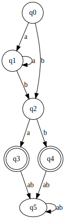

$((aa^*b)+b)(a+b)$

$\to$

<table>
    <tr><td></td><td>q0</td><td>q1</td><td>q2</td><td>q3</td><td>q4</td></tr>
    <tr><td>q1</td><td></td></tr>
    <tr><td>q2</td><td>✘</td><td>✘</td></tr>
    <tr><td>q3</td><td>✘</td><td>✘</td><td>✘</td></tr>
    <tr><td>q4</td><td>✘</td><td>✘</td><td>✘</td><td>✘</td></tr>
    <tr><td>q5</td><td></td><td></td><td>✘</td><td></td><td></td></tr>
</table>

$\to$

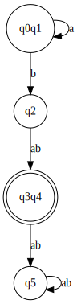

$a^*b(a+b)$

$$\begin{aligned}
    (q_1, q_0)~~~~~~~~~~~~~~~~~~~~~~~~~~~~~~~~~~~~~~~~~~~~~~~
    \\ δ(q_1, a) = q_1, ~δ(q_1, b) = q_2
    \\ δ(q_0, a) = q_1, ~δ(q_0, b) = q_2
    \\----------------
    \\ (q_2, q_0)~~~~~~~~~~~~~~~~~~~~~~~~~~~~~~~~~~~~~~~~~~~~~~~
    \\ check - δ(q_2, a) = q_3, ~δ(q_2, b) = q_4
    \\ δ(q_0, a) = q_1, ~δ(q_0, b) = q_2
    \\ (q_2, q_1)~~~~~~~~~~~~~~~~~~~~~~~~~~~~~~~~~~~~~~~~~~~~~~~
    \\ check - δ(q_2, a) = q_3, ~δ(q_2, b) = q_4
    \\ δ(q_1, a) = q_1, ~δ(q_1, b) = q_2
    \\----------------
    \\ (q_5, q_0)~~~~~~~~~~~~~~~~~~~~~~~~~~~~~~~~~~~~~~~~~~~~~~~
    \\ δ(q_5, a) = q_5, ~δ(q_5, b) = q_5
    \\ δ(q_0, a) = q_1, ~δ(q_0, b) = q_2
    \\ (q_5, q_1)~~~~~~~~~~~~~~~~~~~~~~~~~~~~~~~~~~~~~~~~~~~~~~~
    \\ δ(q_5, a) = q_5, ~δ(q_5, b) = q_5
    \\ δ(q_1, a) = q_1, ~δ(q_1, b) = q_2
    \\ (q_5, q_2)~~~~~~~~~~~~~~~~~~~~~~~~~~~~~~~~~~~~~~~~~~~~~~~
    \\ δ(q_5, a) = q_5, ~δ(q_5, b) = q_5
    \\ δ(q_2, a) = q_3, ~δ(q_2, b) = q_4
    \\ (q_5, q_3)~~~~~~~~~~~~~~~~~~~~~~~~~~~~~~~~~~~~~~~~~~~~~~~
    \\ δ(q_5, a) = q_5, ~δ(q_5, b) = q_5
    \\ δ(q_3, a) = q_5, ~δ(q_1, b) = q_5
    \\ (q_5, q_4)~~~~~~~~~~~~~~~~~~~~~~~~~~~~~~~~~~~~~~~~~~~~~~~
    \\ δ(q_5, a) = q_5, ~δ(q_5, b) = q_5
    \\ δ(q_4, a) = q_5, ~δ(q_1, b) = q_5
\end{aligned}$$

$$\begin{aligned}
    ------- \text{ Repeat } -------
    \\ (q_1, q_0)~~~~~~~~~~~~~~~~~~~~~~~~~~~~~~~~~~~~~~~~~~~~~~~
    \\ δ(q_1, a) = q_1, ~δ(q_1, b) = q_2
    \\ δ(q_0, a) = q_1, ~δ(q_0, b) = q_2
    \\----------------
    \\ (q_5, q_0)~~~~~~~~~~~~~~~~~~~~~~~~~~~~~~~~~~~~~~~~~~~~~~~
    \\ δ(q_5, a) = q_5, ~δ(q_5, b) = q_5
    \\ δ(q_0, a) = q_1, ~δ(q_0, b) = q_2
    \\ (q_5, q_1)~~~~~~~~~~~~~~~~~~~~~~~~~~~~~~~~~~~~~~~~~~~~~~~
    \\ δ(q_5, a) = q_5, ~δ(q_5, b) = q_5
    \\ δ(q_1, a) = q_1, ~δ(q_1, b) = q_2
    \\ (q_5, q_3)~~~~~~~~~~~~~~~~~~~~~~~~~~~~~~~~~~~~~~~~~~~~~~~
    \\ δ(q_5, a) = q_5, ~δ(q_5, b) = q_5
    \\ δ(q_3, a) = q_5, ~δ(q_1, b) = q_5
    \\ (q_5, q_4)~~~~~~~~~~~~~~~~~~~~~~~~~~~~~~~~~~~~~~~~~~~~~~~
    \\ δ(q_5, a) = q_5, ~δ(q_5, b) = q_5
    \\ δ(q_4, a) = q_5, ~δ(q_1, b) = q_5
\end{aligned}$$

#### B)

|        | $a$   | $b$   |
| -----: | :---- | :---- |
| $→q_0$ | $q_1$ | $q_2$ |
|  $q_1$ | $q_0$ | $q_2$ |
| $⋆q_2$ | $q_1$ | $q_0$ |

$\to$

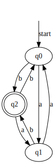

$(b((bb)^*+(a^*b)^*))+(aa^*b(bb)^*)^*$

$\to$

<table>
    <tr><td></td><td>q0</td><td>q1</td></tr>
    <tr><td>q1</td><td>✘</td></tr>
    <tr><td>q2</td><td>✘</td><td>✘</td></tr>
</table>

$\to$

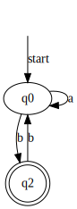

$a^*(b((a^* + b)b)^*)$

$$\begin{aligned}
    (q_1, q_0)~~~~~~~~~~~~~~~~~~~~~~~~~~~~~~~~~~~~~~~~~~~~~~~
    \\ δ(q_1, a) = q_0, ~δ(q_1, b) = q_2
    \\ δ(q_0, a) = q_1, ~δ(q_0, b) = q_2
\end{aligned}$$

#### C)

|        | $a$   | $b$   | $c$   |
| -----: | :---- | :---- | :---- |
| $→q_1$ | $q_6$ | $q_2$ | $q_4$ |
|  $q_2$ | $q_3$ | $q_6$ | $q_6$ |
|  $q_3$ | $q_4$ | $q_5$ | $q_6$ |
|  $q_4$ | $q_2$ | $q_6$ | $q_5$ |
| $⋆q_5$ | $q_6$ | $q_6$ | $q_6$ |
|  $q_6$ | $q_6$ | $q_6$ | $q_6$ |

$\to$

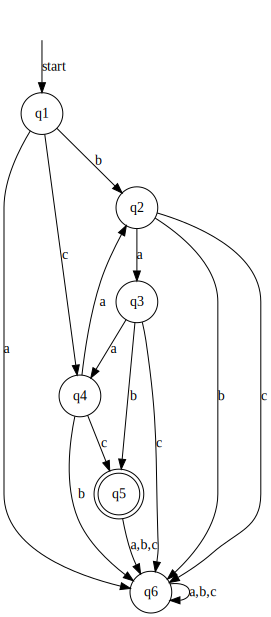

$\to$

<table>
    <tr><td></td><td>q1</td><td>q2</td><td>q3</td><td>q4</td><td>q5</td></tr>
    <tr><td>q2</td><td>✘</td></tr>
    <tr><td>q3</td><td>✘</td><td>✘</td></tr>
    <tr><td>q4</td><td>✘</td><td>✘</td><td>✘</td></tr>
    <tr><td>q5</td><td>✘</td><td>✘</td><td>✘</td><td>✘</td></tr>
    <tr><td>q6</td><td>✘</td><td>✘</td><td>✘</td><td>✘</td><td></td></tr>
</table>

$\to$

<!--  -->

$$\begin{aligned}
    (q_2, q_1)~~~~~~~~~~~~~~~~~~~~~~~~~~~~~~~~~~~~~~~~~~~~~~~~~~~~~~~~~~~~~~~~~~~~~~~~~~~
    \\ δ(q_2, a) = q_3, ~δ(q_2, b) = q_6, ~δ(q_2, c) = q_6
    \\ δ(q_1, a) = q_6, ~δ(q_1, b) = q_2, ~δ(q_1, c) = q_4
    \\----------------------
    \\ (q_3, q_1)~~~~~~~~~~~~~~~~~~~~~~~~~~~~~~~~~~~~~~~~~~~~~~~~~~~~~~~~~~~~~~~~~~~~~~~~~~~
    \\ δ(q_3, a) = q_4, ~δ(q_3, b) = \underline{q_5}, ~δ(q_3, c) = q_6
    \\ δ(q_1, a) = q_6, ~δ(q_1, b) = q_2, ~δ(q_1, c) = q_4
    \\ (q_3, q_2)~~~~~~~~~~~~~~~~~~~~~~~~~~~~~~~~~~~~~~~~~~~~~~~~~~~~~~~~~~~~~~~~~~~~~~~~~~~
    \\ δ(q_3, a) = q_4, ~δ(q_3, b) = \underline{q_5}, ~δ(q_3, c) = q_6
    \\ δ(q_2, a) = q_3, ~δ(q_2, b) = q_6, ~δ(q_2, c) = q_6
    \\----------------------
    \\ (q_4, q_1)~~~~~~~~~~~~~~~~~~~~~~~~~~~~~~~~~~~~~~~~~~~~~~~~~~~~~~~~~~~~~~~~~~~~~~~~~~~
    \\ δ(q_4, a) = q_2, ~δ(q_3, b) = q_6, ~δ(q_3, c) = \underline{q_5}
    \\ δ(q_1, a) = q_6, ~δ(q_1, b) = q_2, ~δ(q_1, c) = q_4
    \\ (q_4, q_2)~~~~~~~~~~~~~~~~~~~~~~~~~~~~~~~~~~~~~~~~~~~~~~~~~~~~~~~~~~~~~~~~~~~~~~~~~~~
    \\ δ(q_4, a) = q_2, ~δ(q_3, b) = q_6, ~δ(q_3, c) = \underline{q_5}
    \\ δ(q_2, a) = q_3, ~δ(q_2, b) = q_6, ~δ(q_2, c) = q_6
    \\ (q_4, q_3)~~~~~~~~~~~~~~~~~~~~~~~~~~~~~~~~~~~~~~~~~~~~~~~~~~~~~~~~~~~~~~~~~~~~~~~~~~~
    \\ δ(q_4, a) = q_2, ~δ(q_3, b) = q_6, ~δ(q_3, c) = \underline{q_5}
    \\ δ(q_3, a) = q_4, ~δ(q_3, b) = \underline{q_5}, ~δ(q_3, c) = q_6
    \\----------------------
    \\ (q_6, q_1)~~~~~~~~~~~~~~~~~~~~~~~~~~~~~~~~~~~~~~~~~~~~~~~~~~~~~~~~~~~~~~~~~~~~~~~~~~~
    \\ δ(q_6, a) = q_6, ~δ(q_6, b) = q_6, ~δ(q_6, c) = q_6
    \\ δ(q_1, a) = q_6, ~δ(q_1, b) = q_2, ~δ(q_1, c) = q_4
    \\ (q_6, q_2)~~~~~~~~~~~~~~~~~~~~~~~~~~~~~~~~~~~~~~~~~~~~~~~~~~~~~~~~~~~~~~~~~~~~~~~~~~~
    \\ δ(q_6, a) = q_6, ~δ(q_6, b) = q_6, ~δ(q_6, c) = q_6
    \\ δ(q_2, a) = q_3, ~δ(q_2, b) = q_6, ~δ(q_2, c) = q_6
    \\ (q_6, q_3)~~~~~~~~~~~~~~~~~~~~~~~~~~~~~~~~~~~~~~~~~~~~~~~~~~~~~~~~~~~~~~~~~~~~~~~~~~~
    \\ δ(q_6, a) = q_6, ~δ(q_6, b) = q_6, ~δ(q_6, c) = q_6
    \\ δ(q_3, a) = q_4, ~δ(q_3, b) = \underline{q_5}, ~δ(q_3, c) = q_6
    \\ (q_6, q_4)~~~~~~~~~~~~~~~~~~~~~~~~~~~~~~~~~~~~~~~~~~~~~~~~~~~~~~~~~~~~~~~~~~~~~~~~~~~
    \\ δ(q_6, a) = q_6, ~δ(q_6, b) = q_6, ~δ(q_6, c) = q_6
    \\ δ(q_4, a) = q_2, ~δ(q_3, b) = q_6, ~δ(q_3, c) = \underline{q_5}
    \\ (q_6, q_5)~~~~~~~~~~~~~~~~~~~~~~~~~~~~~~~~~~~~~~~~~~~~~~~~~~~~~~~~~~~~~~~~~~~~~~~~~~~
    \\ δ(q_6, a) = q_6, ~δ(q_6, b) = q_6, ~δ(q_6, c) = q_6
    \\ δ(q_5, a) = q_6, ~δ(q_5, b) = q_6, ~δ(q_5, c) = q_6
\end{aligned}$$

$$\begin{aligned}
    ------\text{Repeat until same results}-------
    \\ (q_2, q_1)~~~~~~~~~~~~~~~~~~~~~~~~~~~~~~~~~~~~~~~~~~~~~~~~~~~~~~~~~~~~~~~~~~~~~~~~~~~
    \\ δ(q_2, a) = q_3, ~δ(q_2, b) = q_6, ~δ(q_2, c) = \underline{q_6}
    \\ δ(q_1, a) = q_6, ~δ(q_1, b) = q_2, ~δ(q_1, c) = \underline{q_4}
    \\----------------------
    \\ (q_6, q_1)~~~~~~~~~~~~~~~~~~~~~~~~~~~~~~~~~~~~~~~~~~~~~~~~~~~~~~~~~~~~~~~~~~~~~~~~~~~
    \\ δ(q_6, a) = q_6, ~δ(q_6, b) = q_6, ~δ(q_6, c) = \underline{q_6}
    \\ δ(q_1, a) = q_6, ~δ(q_1, b) = q_2, ~δ(q_1, c) = \underline{q_4}
    \\ (q_6, q_2)~~~~~~~~~~~~~~~~~~~~~~~~~~~~~~~~~~~~~~~~~~~~~~~~~~~~~~~~~~~~~~~~~~~~~~~~~~~
    \\ δ(q_6, a) = \underline{q_6}, ~δ(q_6, b) = q_6, ~δ(q_6, c) = q_6
    \\ δ(q_2, a) = \underline{q_3}, ~δ(q_2, b) = q_6, ~δ(q_2, c) = q_6
    \\ (q_6, q_5)~~~~~~~~~~~~~~~~~~~~~~~~~~~~~~~~~~~~~~~~~~~~~~~~~~~~~~~~~~~~~~~~~~~~~~~~~~~
    \\ δ(q_6, a) = q_6, ~δ(q_6, b) = q_6, ~δ(q_6, c) = q_6
    \\ δ(q_5, a) = q_6, ~δ(q_5, b) = q_6, ~δ(q_5, c) = q_6
\end{aligned}$$

---

### Question 4

#### Convert the following regular expressions to $ϵ$-NFA’s.

#### A) $1(01+10)∗+0(11+10)∗$
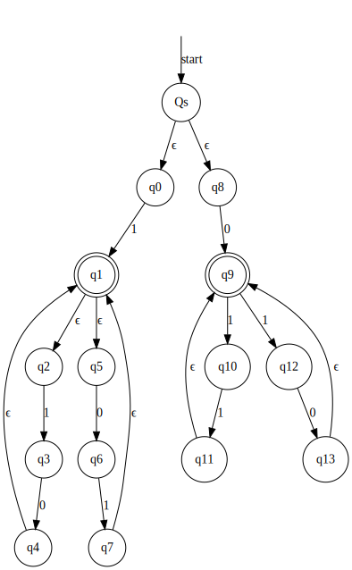

#### B) $(000)∗(ϵ+011+001)(111)∗$
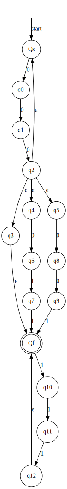

#### C) $(01+10)∗+(00+11)∗+(1+10+100)∗$
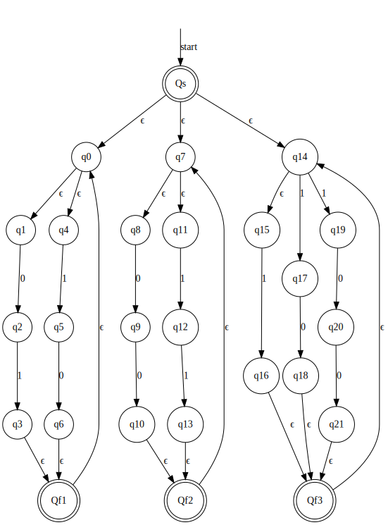

---

### Question 5
#### Apply the Pumping Lemma to prove that the following languages are not regular.
#### A) $\{w∈\{a,b\}^*∶|n_a(w)−n_b(w)|≤3\}$
> $$\begin{aligned}
    w = a^nb^{n-1}
    \\
    \\ \text{Let } m \text{ be the pumping length}
    \\ w = a^mb^{m-1}
    \\ \text{Decompose } a^mb^{m-1} \text{ into } xyz
    \\ \text{such that } |xy| \leq m \text{ and } |y^i| \geq 1
    \\ \Large\overset{\underbrace{a}}{x}\overset{\underbrace{a^{m-1}}}{y}\overset{\underbrace{b^{m-1}}}{z}
    \\
    \\ \text{Now by pumping up one time we get:}
    \\ aa^{m-1}a^{m-1}b^{m-1} =
    \\ a^{m}a^{m-1}b^{m-1} =
    \\ a^{2m-1}b^{m-1}
    \\ \text{For } m = 4:
    \\ [2(4)-1] - [4-1]= 7-3 = 4
    \\ \text{This violates the language if } m \geq 4
    \\ \therefore \text{ this language is not regular}
\end{aligned}$$

#### B) $\{a^kb^n∶n=2^k\}$
> $$\begin{aligned}
    w = a^nb^{2^n}
    \\
    \\ \text{Let } m \text{ be the pumping length}
    \\ w = a^mb^{2^m}
    \\ \text{Decompose } a^mb^{2^m} \text{ into } xyz
    \\ \text{such that } |xy| \leq m \text{ and } |y^i| \geq 1
    \\ \Large\overset{\underbrace{a}}{x}\overset{\underbrace{a^{m-1}}}{y}\overset{\underbrace{b^{2^m}}}{z}
    \\
    \\ \text{Now by pumping up one time we get:}
    \\ aa^{m-1}a^{m-1}b^{2^m} =
    \\ a^{m}a^{m-1}b^{2^m} =
    \\ a^{2m-1}b^{2^m}
    \\ \text{This violates the language}
    \\ \therefore \text{ this language is not regular}
\end{aligned}$$

#### C) $\{w∈\{a,b\}^*∶w^R=w\}$
> $$\begin{aligned}
    w = a^nba^n
    \\ w^R = a^nba^n
    \\
    \\ \text{Let } m \text{ be the pumping length}
    \\ w = a^mba^m
    \\ \text{Decompose } a^mba^m \text{ into } xyz
    \\ \text{such that } |xy| \leq m \text{ and } |y^i| \geq 1
    \\ \Large\overset{\underbrace{a}}{x}\overset{\underbrace{a^{m-1}b}}{y}\overset{\underbrace{aa}}{z}
    \\
    \\ \text{Now by pumping up one time we get:}
    \\ aa^{m-1}ba^{m-1}baa
    \\ \text{This violates the language}
    \\ \therefore \text{ this language is not regular}
\end{aligned}$$

#### D) $\{vw∶v∈\{a,b\}^*,w∈\{c,d\}^*,|v|=|w|\}$
> $$\begin{aligned}
    v = a^nb^n
    \\ w = c^nd^n
    \\ vw = a^nb^nc^nd^n
    \\
    \\ \text{Let } m \text{ be the pumping length}
    \\ vw = a^mb^mc^md^m
    \\ \text{Decompose } a^mb^mc^md^m \text{ into } xyz
    \\ \text{such that } |xy| \leq m \text{ and } |y^i| \geq 1
    \\ \Large\overset{\underbrace{a}}{x}\overset{\underbrace{a^{m-1}}}{y}\overset{\underbrace{b^mc^md^m}}{z}
    \\
    \\ \text{Now by pumping up one time we get:}
    \\ aa^{m-1}a^{m-1}b^mc^md^m =
    \\ aa^{2m-2}b^mc^md^m =
    \\ a^{2m-1}b^mc^md^m
    \\ |v| = m+2m-1
    \\ |w| = 2m
    \\ \text{This violates the language if } m > 1
    \\ \therefore \text{ this language is not regular}
\end{aligned} $$

---

### Question 6

#### Let $h$ be the homomorphism $h∶\{a,b\}→\{0,1\}^*$ given by $h(a)=01,h(b)=011$, and define $L=\{w∈\{0,1\}^*~∶~n_1(w) \not\equiv 0(\mod3)\}$. Construct a DFA for $h^{−1}(L)$
<!-- $$\begin{aligned}
    \text{Let } L_1 = (10+1)^*, L_2 = (a+b)^*
    \\ L_3 = \{(01) : |w|_0 = |w|_1\}
    \\ h^{-1}(L_1) = \emptyset
    \\ h^{-1}(L_2) = (a+0)^*
    \\ h^{-1}(L_3) = a^*
\end{aligned}$$ -->

---

### Question 7

#### A) Suppose language $L$ is accepted by FA $M$. Let $L^E$ be the subset of $L$ consisting of those strings in $L$ that are of even length. Show how to convert $M$ to an FA for $L^E$.
<!-- The language by the string S length AS \{\epsilon, ab, ba, aa, bb, aabb,...\}
The set of languages -->

#### B) For a language $L$, define $L^′$ to be the set of all strings obtained by altering at most onesymbol in a string of $L$. Show how to convert an FA for $L$ into one for $L^′$.

---

### Question 8

#### Draw the table of distinguishabilities for the DFA below (run the TF algorithm), and then construct the minimum state equivalent DFA.

|         | $0$  | $1$  |
| ------: | :--- | :--- |
| $\to A$ | $B$  | $A$  |
|     $B$ | $A$  | $C$  |
|     $C$ | $D$  | $B$  |
|    $*D$ | $D$  | $A$  |
|     $E$ | $D$  | $F$  |
|     $F$ | $G$  | $E$  |
|     $F$ | $G$  | $E$  |
|     $G$ | $F$  | $G$  |
|     $H$ | $G$  | $D$  |

Remove 
Unreachable 
States

 $\to$

|         | $0$  | $1$  |
| ------: | :--- | :--- |
| $\to A$ | $B$  | $A$  |
|     $B$ | $A$  | $C$  |
|     $C$ | $D$  | $B$  |
|    $*D$ | $D$  | $A$  |

*Table 
Filling 
Algorithm

 $\to$

    <table>
        <tr><td></td><td>A</td><td>B</td><td>C</td></tr>
        <tr><td>B</td><td>✘</td></tr>
        <tr><td>C</td><td>✘</td><td>✘</td></tr>
        <tr><td>D</td><td>✘</td><td>✘</td><td>✘</td></tr>
    </table>

Convert 
To 
DFA

 $\to$

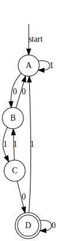

$$\begin{aligned}
    \\ (B,A)~~~~~~~~~~~~~~~~~~~~~~~~~~~~~~~~~~~~~~~~~~~~
    \\ δ(B, 0) = A, ~δ(B, 1) = C
    \\ δ(A, 0) = B, ~δ(A, 1) = A
    \\ (C,A)~~~~~~~~~~~~~~~~~~~~~~~~~~~~~~~~~~~~~~~~~~~~
    \\ δ(C, 0) = D, ~δ(C, 1) = B
    \\ δ(A, 0) = B, ~δ(A, 1) = A
    \\ (C,B)~~~~~~~~~~~~~~~~~~~~~~~~~~~~~~~~~~~~~~~~~~~~
    \\ δ(C, 0) = D, ~δ(C, 1) = B
    \\ δ(B, 0) = A, ~δ(B, 1) = C
    \\
    \\--- \text{Keep going until repeat} ---
    \\ (B,A)~~~~~~~~~~~~~~~~~~~~~~~~~~~~~~~~~~~~~~~~~~~~
    \\ δ(B, 0) = A, ~δ(B, 1) = C
    \\ δ(A, 0) = B, ~δ(A, 1) = A
    \\
    \\--- \text{All spaces filled - stop} ---
\end{aligned} $$

---

### Question 9

#### Find minimal DFA’s for the following languages. In each case prove (!) that your DFA isminimal.

**Note:** subscript is denoting that the given spot got filled on the $n^{th}$ time through the TF-algrithm

#### A) $\{a^nb^m∶ n ≥ 2, m ≥ 1\}$
**Note:** Since the language wasn't given, I'm assuming it's $\Sigma=\{a,b\}$

 $\to$

<table>
    <tr><td></td><td>Qs</td><td>q0</td><td>q1</td><td>q2</td></tr>
    <tr><td>q0</td><td>X3</td></tr>
    <tr><td>q1</td><td>X2</td><td>X2</td></tr>
    <tr><td>q2</td><td>X1</td><td>X1</td><td>X1</td></tr>
    <tr><td>q3</td><td>X3</td><td>X3</td><td>X2</td><td>X2</td></tr>
</table>

> All spots are filled, so the DFA
is at the minimum state already.

#### B) $\{a^nb∶ n ≥ 0\} ∪ \{b^na∶ n ≥ 1\}$
**Note:** Since the language wasn't given, I'm assuming it's $\Sigma=\{a,b\}$

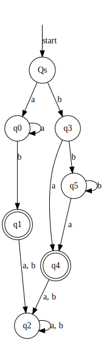

 $\to$

<table>
    <tr><td></td><td>Qs</td><td>q0</td><td>q1</td><td>q2</td><td>q3</td><td>q4</td></tr>
    <tr><td>q0</td><td>X2</td></tr>
    <tr><td>q1</td><td>X1</td><td>X1</td></tr>
    <tr><td>q2</td><td>X2</td><td>X2</td><td>X2</td></tr>
    <tr><td>q3</td><td>X2</td><td>X2</td><td>X2</td><td>X2</td></tr>
    <tr><td>q4</td><td>X1</td><td>X1</td><td>X1</td><td>X1</td><td>X1</td></tr>
    <tr><td>q5</td><td>X2</td><td>X2</td><td>X2</td><td>X2</td><td>X2</td><td>X2</td></tr>
</table>

> All spots are filled, so the DFA
is at the minimum state already.

#### C) $\{a^n∶ n ≥ 0, n ≠ 3\}$
**Note:** Since the language wasn't given, I'm assuming it's $\Sigma=\{a\}$

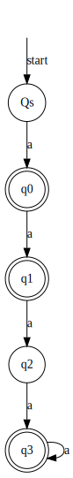

 $\to$

<table>
    <tr><td></td><td>Qs</td><td>q0</td><td>q1</td><td>q2</td></tr>
    <tr><td>q0</td><td>X1</td></tr>
    <tr><td>q1</td><td>X1</td><td>X1</td></tr>
    <tr><td>q2</td><td>X2</td><td>X2</td><td>X2</td></tr>
    <tr><td>q3</td><td>X1</td><td>X1</td><td>X1</td><td>X1</td></tr>
</table>

> All spots are filled, so the DFA
is at the minimum state already.

