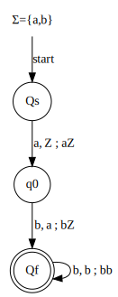

## Question 1: Give context-free grammars for each of the following languages.

#### A) $\{a^hb^ka^mb^n∶ h + k = m + n\}$

> Grammar:
$\{\{S,T,U,V,a,b\},\{a,b\}, P, S\}$
>
> Where the set of productions, $P$, is:
$S \to aSb, ~~~~~T, ~~~~U$
$T \to aTa, ~~~~V$
$U \to bUb, ~~~~V$
$V \to bVa, ~~~~\epsilon$

#### B) $\{a^ib^ja^k∶ (i = j \text{ and }k ≥ 0)\text{ or }(i ≥ 0 \text{ and } j > k)\}$

> Grammar:
$\{\{S,T,U,V,a,b\}, \{a,b\}, P, S\}$
>
> Where the set of productions, $P$, is:
$S \to TA, ~~~~~AU$
$T \to aTb, ~~~~ab$
$U \to bUa, ~~~~bU, ~~~~ b$
$V \to aV, ~~~~~~ \epsilon$

---

## Question 2: Prove that if $G$ is the context-free grammar defined by the productions $S→aSbS|bSaS|\epsilon$, then $L(G)=\{w∈ \{a, b\}∗∶ n_a(w) = n_b(w)\}$.
The productions:
$S \to aSbS~~|~~bSaS~~|~~\epsilon$
only permit the same number of $a$'s and $b$'s because the production is recursively defined where each non-epsilon production is a single $a$ and a single $b$.

You could unwrap these production to obtain:

$a(aSbS|bSaS|ϵ)b(aSbS|bSaS|ϵ)|b(aSbS|bSaS|ϵ)a(aSbS|bSaS|ϵ)|ϵ$

> and continue to unwrap infinitely and on every unwrap, you'd still always have the same number of $a$'s and $b$'s.
>
> Therefore, the set of productions, $S$, must match the language $L(G)$

---

## Question 3: In each case below, show that the grammar is ambiguous, and find an equivalent unambiguous grammar.
#### A) $S→SS|ab|a$
It's ambiguous because you can get "aaba" from two different leftmost derivations:
$S ⇒ SS ⇒ SSS ⇒ aSS ⇒ aabS ⇒ aaba$
AND
$S ⇒ SS ⇒ aS ⇒ aSS ⇒ aabS ⇒ aaba$
> You can make it unambiguous by changing it to $S \to Sa|Sab|a|ab$.
> Then aaba can only be obtained by doing
> $S => Sa => Sab => SabS$

#### B) $S→ABA,~~~~ A→aA|\epsilon,~~~~ B→bB|\epsilon$
It's ambiguous because you can get "a" from two leftmost derivations:
$S ⇒ ABA ⇒ aABA ⇒ a\epsilon ⇒ a\epsilon\epsilon A ⇒ a\epsilon\epsilon\epsilon = a$
$S ⇒ ABA ⇒ \epsilon BA ⇒ \epsilon\epsilon A ⇒ \epsilon\epsilon a = a$
> You can make it unambiguous be changing it to:
$S → ABA|AB|BA|A|B|\epsilon$, where
$A → aA|a$
$B → bB|b$

---

## Question 4: Design a PDA to accept each of the following languages.  You may design your PDA to accept either by final state or empty stack, whichever is more convenient.

#### A) $\{a^hb^ka^mb^n∶ h + k = m + n\}$

<blockquote>

</blockquote>

#### B) $\{a^nb∶ n ≥ 0\} ∪ \{ab^n∶ n ≥ 0\} ∪ \{a^nb^n∶ n ≥ 0\}$

$\{a^nb∶ n ≥ 0\}$

$\{ab^n∶ n ≥ 0\}$

$\{a^nb^n∶ n ≥ 0\}$

<blockquote>

$\therefore \text{ the PDA for } \{a^nb∶ n ≥ 0\} ∪ \{ab^n∶ n ≥ 0\} ∪ \{a^nb^n∶ n ≥ 0\} \text{ is: }$

</blockquote>

---

## Question 5:
#### A) Show that the language $L = \{a^nb^n∶ a,b ∈\{a,b\}, n\text{ is not a multiple of 5}\}$ is context-free.

Since we know that the intersection between a CFL and a regular language is going to be context free, we can break $L$ up into two different language's who's intersection is $L$.

$\text{Let }~~~ L_1 = \{a^nb^n:n \ge 0\}$
$\text{And }~ L_2 = \{w\in\{a,b\}^*: (|w| \mod 10) \neq 0\}$

We can see that $L_1$ is a CFL because we can define the grammar as:
$S -> aSb$
$S -> ab | \epsilon$

For $L_2$ we pick $\mod 10$ instead of $5$ since this is the overall length of the string. Since in $L$, $n$ cannot be a multiple of $5$ and is repeated twice, we know that in $L_2$, it can't be a multiple of $10$.
And as we can see, $L_2$ is clearly regular because it's described by the DFA below:

<blockquote>

Therefore, based on the rule stated above, we know that $L$ is going to be a CFL since $L = L_1 \cap L_2$
</blockquote>

#### B) Let $L = \{a^nb^n∶ n ≥ 0\}, \text{ and } M = \{a^{2m}b^{2p}∶ m ≥ 0, p ≥ 0\}$.  Construct a PDA for $L$ and a DFA$^1$ for $M$. Then use the Cartesian construction to obtain a PDA for $L ∩ M$.

DFA for $\{a^{2m}b^{2p}∶ m ≥ 0, p ≥ 0\}$

PDA for $\{a^nb^n∶ n ≥ 0\}$

<blockquote>

The intersection between $L$ and $M$, $L \cap M$, is:
$\{a^{2n}b^{2n}: n \ge 0\}$

|   State | Input      | Stack | New State | New Stack |
| ------: | :--------- | :---- | :-------- | :-------- |
| $(A,1)$ | $A$        | $Z$   | $(B,1)$   | $Z$       |
| $(A,1)$ | $a$        | $X$   | $(B,1)$   | $X$       |
| $(A,1)$ | $\epsilon$ | $Z$   | $(A,2)$   | $Z$       |
| $(A,1)$ | $\epsilon$ | $X$   | $(A,2)$   | $X$       |
| $(A,2)$ | $b$        | $X$   | $(C,2)$   | $X$       |
| $(A,2)$ | $\epsilon$ | $Z$   | $(A,3)$   | $Z$       |
| $(C,2)$ | $b$        | $X$   | $(D,2)$   | $X$       |
| $(D,2)$ | $b$        | $X$   | $(C,2)$   | $X$       |
| $(D,2)$ | $\epsilon$ | $Z$   | $(D,3)$   | $Z$       |
</blockquote>

---

## Question 6: Convert the following grammars into Chomsky Normal Form
#### A) $S → ASB|\epsilon, ~~~~ A → aAS|a, ~~~~ B → SbS|A|bb$.
#####1. Remove epsilons
$S \to ASB~~|~~AB$
$A \to aAS~~|~~a~~|~~aA$
$B \to SbS~~|~~A~~|~~bb~~|~~Sb~~|~~b~~|~~bS$

#####2. Remove unit productions
$S \to ASB~~|~~AB$
$A \to aAS~~|~~a~~|~~aA$
$B \to SbS~~|~~aAS~~|~~a~~|~~aA~~|~~bb~~|~~Sb~~|~~b~~|~~bS$

#####3. Remove useless productions
No useless productions to remove
$S \to ASB~~|~~AB$
$A \to aAS~~|~~a~~|~~aA$
$B \to SbS~~|~~aAS~~|~~a~~|~~aA~~|~~bb~~|~~Sb~~|~~b~~|~~bS$

#####4. Chomsky Normal Forms
<blockquote>

$M \to a$
$N \to b$
$O \to AS$
$P \to NS$

$S \to OB~~|~~AB$
$A \to MO~~|~~M~~|~~MA$
$B \to SP~~|~~MO~~|~~M~~|~~MA~~|~~NN~~|~~SN~~|~~N~~|~~NS$
</blockquote>

#### B) $S → 0A0|1B1|BB, ~~~~ A → C, ~~~~ B → S|A, ~~~~ C → S|\epsilon$
#####1. Remove epsilons
$S \to 0A0~~|~~1B1~~|~~BB~~|~~00~~|~~11$
$A \to C$
$B \to S~~|~~A$
$C \to S$
#####2. Remove unit productions
$S \to 0A0~~|~~1B1~~|~~BB~~|~~00~~|~~11$
$A \to 0A0~~|~~1B1~~|~~BB~~|~~00~~|~~11$
$B \to 0A0~~|~~1B1~~|~~BB~~|~~00~~|~~11$
$C \to 0A0~~|~~1B1~~|~~BB~~|~~00~~|~~11$

#####3. Remove useless productions
$S \to 0A0~~|~~1B1~~|~~BB~~|~~00~~|~~11$
$A \to 0A0~~|~~1B1~~|~~BB~~|~~00~~|~~11$
$B \to 0A0~~|~~1B1~~|~~BB~~|~~00~~|~~11$

#####4. Chomsky Normal Forms
<blockquote>

$Z \to 0$
$O \to 1$
$U \to AZ$
$V \to B(B1)$

$S \to ZU~~|~~OV~~|~~BB~~|~~ZZ~~|~~OO$
$A \to ZU~~|~~OV~~|~~BB~~|~~ZZ~~|~~OO$
$B \to ZU~~|~~OV~~|~~BB~~|~~ZZ~~|~~OO$
</blockquote>

---

## Question 7: Use the Pumping Lemma for CFL’s to show that the following languages are not Context-Free.
#### A) $\{w∈\{a,b,c\}^*∶ n_a(w) < n_b(w) \text{ and } n_a(w) < n_c(w)\}$
TODO

#### B) $\{a^nb^jc^kd^l∶ n ≤ k \text{ and } j ≤ l\}$
TODO

---

## Question 8:
#### Consider the PDA $P=\{\{q_0,q_1,q_2\}, \{a\}, \{♣,Z_0\}, δ, q_0, Z_0, \{q_2\}\}$, where $δ(q_0, a, Z_0) = \{(q_1, ♣Z_0)\}, δ(q_1, a, ♣) = \{(q_0, \epsilon)\}$, and $δ(q_0, \epsilon, Z_0) = \{(q_2, \epsilon)\}$.
#### Construct a CFG (using the method in the text) corresponding to $P$.

<blockquote>

$S \to [q_0Z_0q_0] ~~|~~ [q_0Z_0q_1] ~~|~~ [q_0Z_0q_2]$
$[q_0Z_0q_0] → \epsilon[q_1♣q_0][q_0Z_0q_0] ~~|~~ \epsilon[q_1♣q_1][q_1Z_0q_0] ~~|~~ \epsilon[q_1♣q_2][q_2Z_0q_0]$
$[q_0Z_0q_1] → \epsilon[q_1♣q_0][q_0Z_0q_1] ~~|~~ \epsilon[q_1♣q_1][q_1Z_0q_1] ~~|~~ \epsilon[q_1♣q_2][q_2Z_0q_1]$
$[q_0Z_0q_2] → \epsilon[q_1♣q_0][q_0Z_0q_2] ~~|~~ \epsilon[q_1♣q_1][q_1Z_0q_2] ~~|~~ \epsilon[q_1♣q_2][q_2Z_0q_2]$
$[q_0Z_0q_2] → \epsilon$
$[q_1♣q_0] → a$
</blockquote>
